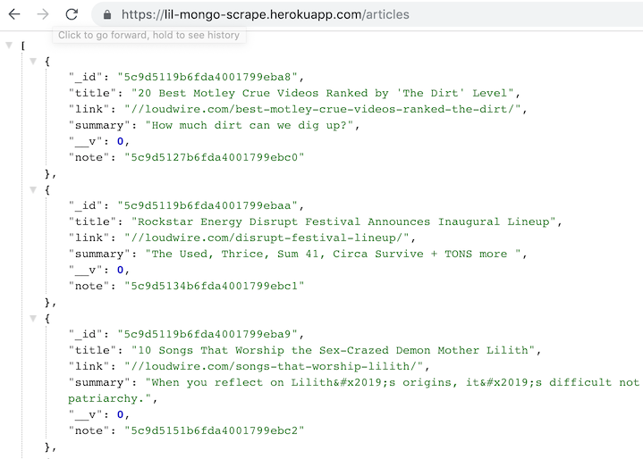
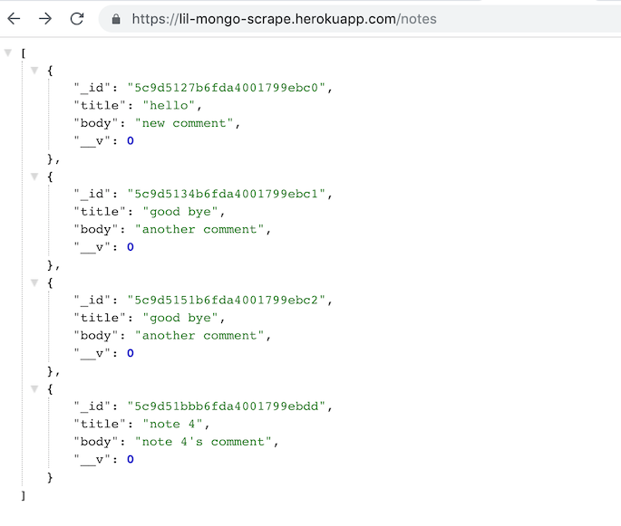

# Mongo-Scraper

### Overview

This full stack web application lets users view and leave comments on the latest news. The app uses Cheerio to scrape another site and sends that data to a Mongo database where it is populated with Mongoose and rendered to the page with handlebars. The app also allows the user to leave comments on the scraped articles and then saved to the Mongoose database, so the user can refer to their note, even after they refresh the page.

### required npm packages

`express`, `express-handlebars`, `mongoose`, `cheerio`, `axois`

## UI

## Database

the /articles route will show all the articles saved to the database as json

the /notes route will show all the notes saved to the data base as json

### Technologies Implemented

* Bootstrap
* Express
* Node.js
* Heroku/mLab MongoDB
* Handlebars

### Live site

* deployed: https://lil-mongo-scrape.herokuapp.com/